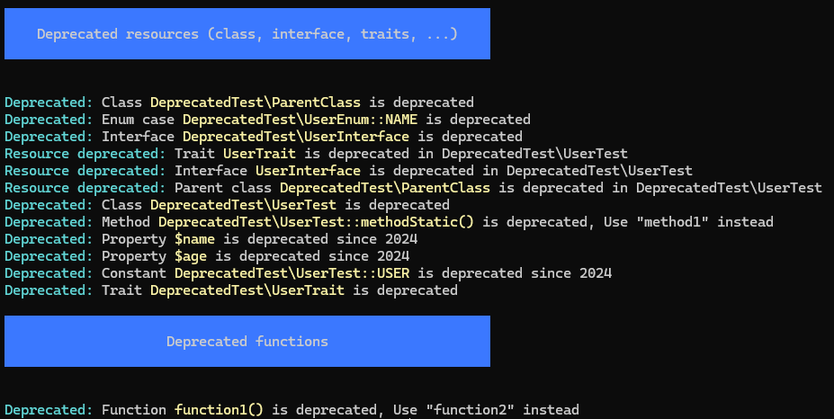

# PHP DEPRECATED

PHP component used to search for deprecated resources in your project, such as classes, traits, enums, and others.

## Installation

```bash
composer require brenno-duarte/phpdeprecated
```

## How to use

To use this component, let's assume you have a class called `User`. However, you want to discontinue this class. You must add the `Deprecated` attribute to this class:

```php
<?php

use Deprecated\Deprecated;

#[Deprecated()]
class User
{
}
```

This way, this class will be marked as deprecated. You can add a message in the attribute constructor and also the date the class was deprecated.

```php
<?php

use Deprecated\Deprecated;

#[Deprecated("use other class", "2024-06-01")]
class User
{
}
```

You can add this attribute to classes, traits, properties, interfaces and methods.

## Checking deprecated resources

To check if exists deprecated resources with `Deprecated` attribute, simply run the command below in the terminal:

```bash
vendor/bin/phpdeprecated <directory>
```

Replace the `<directory>` with the name of the directory you want to search for deprecated resources. The end result will be similar to the image below:

